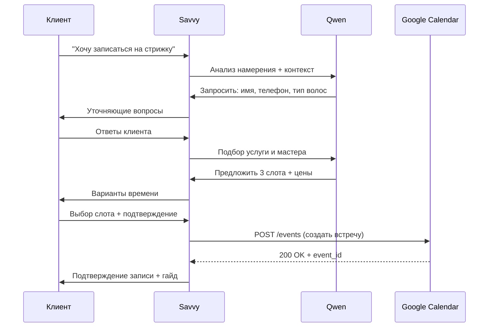

# 🤖 ИИ-ассистент для салона красоты «Кудряшка»

Ссылка:@kdr123456789_bot

[](LICENSE)
[](https://qwenlm.github.io/)
[](https://app.suvvy.ai/)

> Интеллектуальный чат-бот для автоматизации записи клиентов, ответов на вопросы и управления расписанием салона красоты.

---

## 📋 Оглавление

- [О проекте](#-о-проекте)
- [Функционал](#-функционал)
- [Технологический стек](#-технологический-стек)
- [Архитектура решения](#-архитектура-решения)
- [Настройка и запуск](#-настройка-и-запуск)
- [Структура проекта](#-структура-проекта)
- [Примеры диалогов](#-примеры-диалогов)
- [База знаний](#-база-знаний)
- [Интеграции](#-интеграции)
- [Тестирование](#-тестирование)
- [Вклад в проект](#-вклад-в-проект)
- [Лицензия](#-лицензия)

---

## 📌 О проекте

**ИИ-ассистент для салона красоты** — это интеллектуальный чат-бот, который помогает автоматизировать коммуникацию с клиентами салона «Кудряшка». Бот ведёт осмысленный диалог, отвечает на вопросы по услугам и ценам, помогает подобрать мастера и записывает клиента на удобное время с автоматической синхронизацией в Google Календарь.

### 🎯 Цели проекта

- ✅ Снизить нагрузку на администраторов за счёт автоматизации рутинных запросов
- ✅ Увеличить конверсию в запись за счёт мгновенных ответов 24/7
- ✅ Обеспечить единый стандарт качества ответов и бренда
- ✅ Минимизировать ошибки при записи (дубли, «окна», неявки)

### 🎁 Для кого этот проект

- Владельцы салонов красоты и парикмахерских
- Разработчики чат-ботов и ИИ-решений
- Специалисты по автоматизации бизнес-процессов
- Энтузиасты no-code/low-code решений на базе ИИ

---

## ⚡ Функционал

### 🗣 Осмысленное ведение диалога

- Понимание естественного языка с учётом контекста разговора
- Поддержка многоходовых сценариев: запись → уточнение → подтверждение → напоминание
- Распознавание намерений: `запись`, `вопрос_об_услуге`, `отмена`, `перенос`, `жалоба`
- Адаптивный стиль общения: тёплый, экспертный, без канцелярита

### 📚 Ответы на вопросы по базе знаний

- Динамическая подгрузка актуальной информации:
  - Прайс-лист с диапазонами и условиями доплат
  - Профили мастеров: специализация, рейтинг, портфолио
  - Гайды по подготовке к визиту (сухая стрижка, уход до/после)
  - Ответы на частые вопросы (кудрявый метод, биозавивка, окрашивание)
- Автоматическое предложение релевантных статей при неоднозначных запросах

### 📅 Запись клиента на консультацию или услугу

Пошаговый алгоритм записи:

```
1. Идентификация → имя, телефон, тип волос
2. Выявление потребности → услуга, мастер, пожелания
3. Подбор слота → проверка доступности, предложение 3 вариантов
4. Подтверждение → отправка деталей в чат + напоминание о подготовке
5. Синхронизация → добавление встречи в Google Календарь
```

Особенности:
- ⚠️ Окрашивание и биозавивка — только после предварительной консультации
- 🌿 Обязательное напоминание о подготовке к сухой стрижке
- 💰 Честное ценообразование: диапазон + доплаты за длину/густоту

### 🔄 Добавление встречи в Google Календарь

- Автоматическое создание события при подтверждении записи
- Структура события:
  ```
  Название: [Услуга] • [Имя клиента]
  Время: [начало]–[окончание] (с учётом длительности услуги + буфер 15 мин)
  Описание: 
    • Телефон: [номер]
    • Тип волос: [тип]
    • Особые пожелания: [заметки]
    • Подготовка: [гайд]
  Напоминание: за 24 часа (email + push)
  ```
- Поддержка отмены/переноса с обновлением календаря
- Цветовая маркировка по типу услуги (стрижка/окрашивание/уход)

---

## 🛠 Технологический стек

| Компонент | Технология / Сервис | Назначение |
|-----------|-------------------|------------|
| 🧠 Языковая модель | **Qwen** (Alibaba) | Генерация системного промпта, обработка диалогов, RAG для базы знаний |
| 🤖 Платформа бота | **Savvy** (app.suvvy.ai) | No-code сборка ассистента, управление сценариями, аналитика диалогов |
| 📆 Календарь | **Google Calendar API** | Синхронизация записей, управление событиями, напоминания |
| 🔗 Интеграции | Webhooks, REST API | Связка Savvy ↔ Google Calendar ↔ внешние системы |
| 🗄 База знаний | Markdown + Qwen RAG | Хранение и поиск по прайсу, профилям мастеров, гайдам |
| 🔐 Безопасность | 152-ФЗ, шифрование сессий | Защита персональных данных клиентов |

---

## 🏗 Архитектура решения

```
┌─────────────────┐
│   Клиент        │
│ (Telegram/Website)│
└────────┬────────┘
         │
         ▼
┌─────────────────┐
│   Savvy Platform│
│ • Обработка NLU │
│ • Управление    │
│   диалогом      │
│ • Триггеры      │
└────────┬────────┘
         │
    ┌────┴────┐
    ▼         ▼
┌────────┐ ┌─────────────┐
│  Qwen  │ │Google Calendar│
│ • RAG  │ │ • Create Event│
│ • Prompt│ │ • Update     │
│ • Ответы│ │ • Cancel     │
└────────┘ └─────────────┘
```

### Поток данных при записи



---

## 🚀 Настройка и запуск

### Предварительные требования

- Аккаунт в [Savvy](https://app.suvvy.ai/)
- Доступ к API Qwen (через DashScope или локально)
- Проект в Google Cloud с включённым Calendar API
- Service Account с правами на управление календарём

### Пошаговая настройка

#### 1. Настройка Qwen и базы знаний

```bash
# Структура папки знаний
knowledge-base/
├── services/          # Услуги и цены (markdown)
├── masters/           # Профили мастеров
├── faq/              # Частые вопросы
├── guides/           # Гайды по подготовке
└── policies/         # Правила отмены, доплаты

# Пример: services/haircut.md
## Стрижка кудрявых волос
- Цена: от 5 600₽
- Длительность: 60–90 мин
- Подготовка: естественно высушенные волосы, без утюжка
- Доплаты: +500₽ (длинные/густые), +800₽ (распутывание >10 мин)
```

#### 2. Создание ассистента в Savvy

1. Зарегистрируйтесь на [app.suvvy.ai](https://app.suvvy.ai/)
2. Создайте нового бота → выберите шаблон «Customer Support»
3. В разделе **System Prompt** вставьте промпт из [`prompt.md`](./prompt.md)
4. В **Knowledge Base** загрузите папку `knowledge-base/`
5. Настройте **Intents**:
   ```yaml
   intents:
     - name: booking_request
       examples: ["записаться", "хочу на стрижку", "подобрать время"]
     - name: price_question
       examples: ["сколько стоит", "прайс", "цена окрашивания"]
     - name: cancellation
       examples: ["отменить запись", "перенести визит"]
   ```

#### 3. Интеграция с Google Calendar

```bash
# 1. Создайте Service Account в Google Cloud Console
# 2. Скачайте JSON-ключ и добавьте переменные окружения:

GOOGLE_APPLICATION_CREDENTIALS="./path/to/key.json"
CALENDAR_ID="primary"  # или ID общего календаря салона
TIMEZONE="Europe/Moscow"

# 3. В Savvy настройте Webhook для создания события:
#    Endpoint: /api/calendar/create
#    Method: POST
#    Payload:
{
  "summary": "{{service}} • {{client_name}}",
  "start": {"dateTime": "{{start_time}}", "timeZone": "{{timezone}}"},
  "end": {"dateTime": "{{end_time}}", "timeZone": "{{timezone}}"},
  "description": "{{client_notes}}",
  "reminders": {"useDefault": false, "overrides": [{"method": "popup", "minutes": 1440}]}
}
```

#### 4. Тестирование локально

```bash
# Используйте тестовые сценарии из /tests
npm run test:dialogue    # Проверка сценариев записи
npm run test:kb          # Проверка ответов по базе знаний
npm run test:calendar    # Проверка интеграции с Google Calendar
```

---

## 📁 Структура проекта

```
kudryashka-ai-assistant/
├── 📄 README.md                 # Этот файл
├── 📄 prompt.md                 # Системный промпт для Qwen
├── 📄 package.json              # Зависимости и скрипты (если есть backend)
│
├── 📁 knowledge-base/           # База знаний для RAG
│   ├── services/               # Услуги и цены (.md)
│   ├── masters/                # Профили мастеров (.md)
│   ├── faq/                    # Частые вопросы (.md)
│   ├── guides/                 # Гайды по подготовке (.md)
│   └── policies/               # Правила и условия (.md)
│
├── 📁 src/
│   ├── 📄 intents.yaml         # Описание намерений для Savvy
│   ├── 📄 calendar-webhook.js  # Обработчик Google Calendar API
│   └── 📄 utils.js             # Вспомогательные функции
│
├── 📁 tests/
│   ├── 📄 dialogue-scenarios.md # Тестовые диалоги
│   ├── 📄 kb-questions.txt      # Вопросы для проверки БЗ
│   └── 📄 calendar-mocks.json   # Моки для API-тестов
│
├── 📁 docs/
│   ├── 📄 api-reference.md     # Документация по вебхукам
│   ├── 📄 deployment-guide.md  # Гайд по развёртыванию
│   └── 📄 troubleshooting.md   # Решение частых проблем
│
└── 📄 .env.example             # Шаблон переменных окружения
```

---

## 💬 Примеры диалогов

### ✅ Успешная запись на стрижку

```
Клиент: Привет, хочу записаться на стрижку кудрей

Бот: Здравствуйте! Рады видеть вас в «Кудряшке» ✨ 
Подскажите, какие у вас кудри (волнистые/кудрявые/очень кудрявые) 
и делали ли вы ранее стрижку по кудрявому методу?

Клиент: Кудрявые, не стригла по-особенному

Бот: Отлично! Для кудрявых волос мы используем сухую стрижку — 
мастер видит естественную форму завитка 💫

Чтобы подобрать время, уточните:
• Ваше имя и телефон для подтверждения
• Предпочтительный день и время
• Есть ли пожелания по мастеру?

[... после сбора данных ...]

✨ Запись подтверждена!
👤 Анна | 🌀 Стрижка + укладка • ⏱ 75 мин
👩‍🎨 Мастер: Александра | 📅 Сб, 15 июня • ⏰ 14:00–15:15
📍 ул. Фадеева 7с2 | 💰 5 600₽
🔔 Напоминание за 24ч | 🔄 Отмена бесплатно за 24ч
🌿 Приходите с естественно высушенными волосами (без утюжка/плойки)
📞 Вопросы: +7 (919) 763-44-41 💜
```

### ❓ Вопрос по базе знаний

```
Клиент: Сколько стоит окрашивание?

Бот: Окрашивание кудрявых волос стоит от 7 500₽. 
Итоговая цена зависит от:
• Длины и густоты волос (+500₽ за длинные/густые)
• Количества оттенков и техники (балаяж, шатуш, однотон)
• Состояния волос (может потребоваться подготовка)

Для точной оценки мастеру нужно увидеть волосы. 
Хотите записаться на бесплатную онлайн-консультацию? 
Это займёт 15 минут и поможет подобрать идеальный вариант 🌿
```

### ⚠️ Обработка особого случая

```
Клиент: Можно на субботу на 15:00 на биозавивку?

Бот: Для биозавивки обязательна предварительная консультация — 
мастер оценит состояние волос и подберёт щадящий состав 💜

Онлайн-консультация — бесплатно, 15–20 минут. 
Свободные слоты на этой неделе:
• Пт, 14 июня • 11:00
• Сб, 15 июня • 10:30  
• Вс, 16 июня • 16:00

Какой вариант вам удобнее? После консультации сразу подберём дату процедуры 🌿
```

---

## 📚 База знаний

### Источники данных

| Тип контента | Формат | Обновление | Ответственный |
|-------------|--------|------------|--------------|
| Прайс-лист | Markdown + таблица | Еженедельно | Администратор |
| Профили мастеров | Markdown + фото | По запросу | Руководитель |
| Гайды по подготовке | Markdown + инфографика | Ежемесячно | Контент-менеджер |
| FAQ | Q&A-формат | По мере поступления вопросов | Поддержка |

### Пример структуры статьи БЗ (`knowledge-base/services/bio-perm.md`)

```markdown
## Биозавивка кудрявых волос

⏱ Длительность: 3–5 часов  
💰 Стоимость: 12 000–35 000₽ (зависит от длины, густоты, состава)  
⚠️ Обязательна консультация перед процедурой

### Что входит:
- Диагностика состояния волос
- Подбор состава (щадящий/интенсивный)
- Процедура завивки + нейтрализация
- Естественная укладка диффузором
- Рекомендации по домашнему уходу

### Подготовка:
- Не мойте голову за 24 часа до визита
- Не используйте стайлинг за 48 часов
- Сообщите мастеру о аллергиях и окрашиваниях

### Противопоказания:
- Беременность (1 триместр)
- Повреждённая кожа головы
- Недавнее химическое выпрямление

[Ссылка на портфолио мастера] | [Записаться на консультацию]
```

---

## 🔗 Интеграции

### Google Calendar API

| Метод | Назначение | Параметры |
|-------|-----------|-----------|
| `POST /events` | Создание записи | `summary`, `start`, `end`, `description`, `attendees` |
| `PUT /events/{id}` | Перенос записи | `event_id`, новые `start`/`end` |
| `DELETE /events/{id}` | Отмена записи | `event_id`, причина (опционально) |

### Webhook от Savvy → Ваш сервер

```json
{
  "event": "booking_confirmed",
  "data": {
    "client_name": "Анна",
    "phone": "+79991234567",
    "service": "Стрижка + укладка",
    "master": "Александра",
    "start_time": "2024-06-15T14:00:00+03:00",
    "duration_minutes": 75,
    "notes": "Кудрявые волосы, аллергия на аммиак"
  }
}
```

### Ответ вашего сервера

```json
{
  "status": "success",
  "calendar_event_id": "abc123xyz",
  "confirmation_sent": true
}
```

---

## 🧪 Тестирование

### Чек-лист перед запуском

- [ ] Бот корректно приветствует на русском/английском
- [ ] Запись на субботу/воскресенье доступна на всё время 10:00–21:00
- [ ] На окрашивание/биозавивку предлагается консультация
- [ ] При подтверждении отправляется гайд по подготовке
- [ ] Событие создаётся в Google Calendar с правильным временем и описанием
- [ ] Отмена записи удаляет событие из календаря
- [ ] База знаний отвечает на 95%+ тестовых вопросов из `tests/kb-questions.txt`

### Автоматические тесты

```bash
# Запустить все тесты
npm test

# Запустить только тесты диалогов
npm run test:dialogue -- --scenario=booking_curly_cut

# Проверить актуальность базы знаний
npm run validate:kb
```

---

## 🤝 Вклад в проект

Мы приветствуем ваш вклад! Вот как можно помочь:

1. **Форкните репозиторий**
2. **Создайте ветку** для вашей фичи: `git checkout -b feature/awesome-feature`
3. **Внесите изменения** и добавьте тесты
4. **Запустите линтер и тесты**: `npm run lint && npm test`
5. **Отправьте пул-реквест** с описанием изменений

### 📋 Контрибьютор-гайд

- 🐞 Нашли баг? Откройте [Issue](../../issues) с шагами воспроизведения
- 💡 Есть идея? Обсудите её в [Discussions](../../discussions) перед реализацией
- 📝 Улучшили документацию? Мы это обожаем! Отправляйте PR 🎉

---

## 📜 Лицензия

Проект распространяется под лицензией **MIT**.  
Подробности — в файле [LICENSE](LICENSE).

```
MIT License

Copyright (c) 2024 Салон «Кудряшка»

Разрешается бесплатное использование, копирование, изменение 
и распространение ПО при условии сохранения уведомления о лицензии.
```

---

## 🙏 Благодарности

- 🧠 [Qwen Team](https://qwenlm.github.io/) — за мощную языковую модель и поддержку RAG
- 🤖 [Savvy](https://app.suvvy.ai/) — за удобную no-code платформу для создания ассистентов
- 💜 Команде салона «Кудряшка» — за экспертизу, обратную связь и доверие
- 🌿 Всем кудрявым людям — за вдохновение делать мир красивее

---

> 💜 **Сделано с заботой о кудрях и автоматизацией с любовью**  
> Если проект был полезен — поставьте ⭐️ и поделитесь с коллегами!

```bash
# Быстрый старт для разработчиков
git clone https://github.com/your-org/kudryashka-ai-assistant.git
cd kudryashka-ai-assistant
cp .env.example .env  # настройте переменные
# Далее — настройка Savvy и Google Calendar по гайду выше
```

[🔗 Вернуться к началу](#-ии-ассистент-для-салона-красоты-кудряшка)
